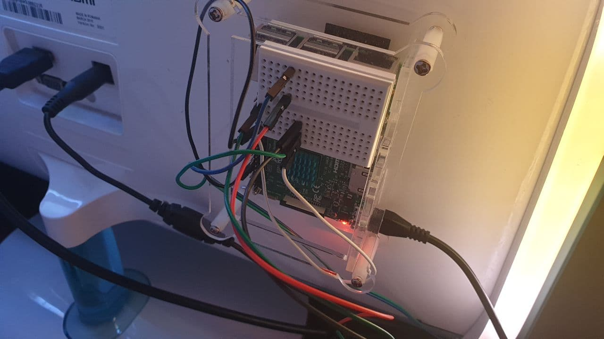

# raspberryPi-led-monitor-backlight
A Python implementation to backlight your computer screen using a Raspberry Pi.

##Example

Wallpaper Source: https://www.pixelstalk.net/wp-content/uploads/2016/06/Color-Wallpapers-images-free-download-620x349.jpg