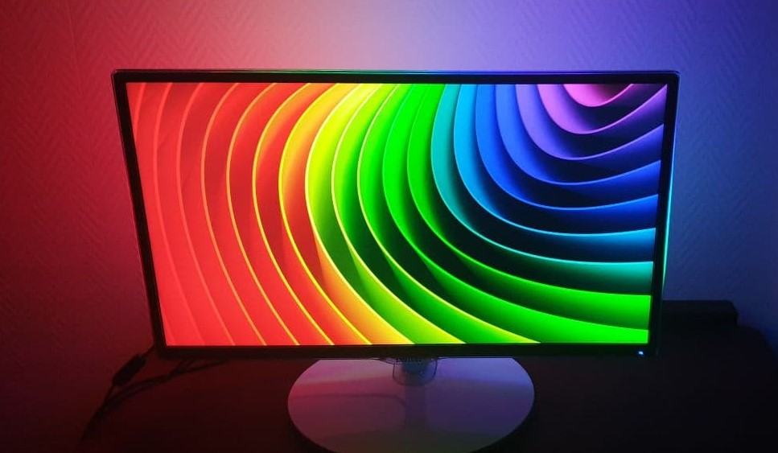
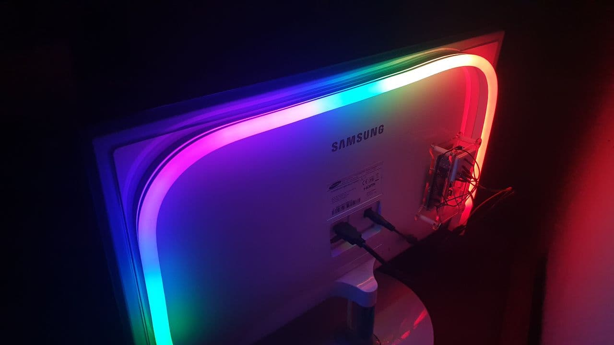

# Build your own PC monitor backlight
A Python implementation to backlight your computer screen using a Raspberry Pi.

## Explanation
The client code on the desktop PC constantly takes a screenshot of the current image output. 
This screenshot is then evaluated locally and the color values are calculated. 
The color values are not immediately set to the new value, rather they approach fastly to the new value to create a smoother experience. 
The calculated color values are then transferred to the Raspberry Pi, which sets the leds with the new color values. 
This process is constantly repeated.

## Example
### Requirements
* PC to run the client script
* Raspberry Pi for running the server script
* Adafruit Neopixel LED strip
* Jumper Wires
* 5-12V power supply

### Pictures

## Known problems
* slight delay between the display and the backlight

## Links
* Adafruit: https://www.adafruit.com/
* Wallpaper Source: https://www.pixelstalk.net/wp-content/uploads/2016/06/Color-Wallpapers-images-free-download-620x349.jpg